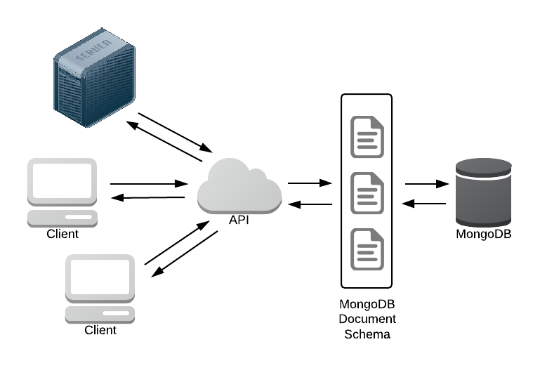

.. OCT Schema

MongoDB Schema Enforcement
==========================

Yeah, yeah ...  MongoDB Schema Enforcement seems like a contradiction
of the MongoDB NoSQL philosophy.  But we probably want some control over
what people will be putting into our Collections (especially if we are
opening this to a RESTful interface) ???

Built over the :mod:`ming` framework, the object here is to provide
a layer of separation from the actual MongoDB interface so that we can
intercept the Document and provide validation, sanitisation, default
settings etc.  :mod:`ming` also supports a migration context that will
ensure that our interface remains consistent as the Collection schema
changes.

The following diagram shows where the **MongoDB Document Schema** layer sits
in the technology stack:

   *OCT RESTful Technology Stack*

Contents:
---------

.. toctree::
   :maxdepth: 2

   modules/session.rst
   modules/models.rst

Indices and tables
-------------------

* :ref:`genindex`
* :ref:`modindex`
* :ref:`search`
